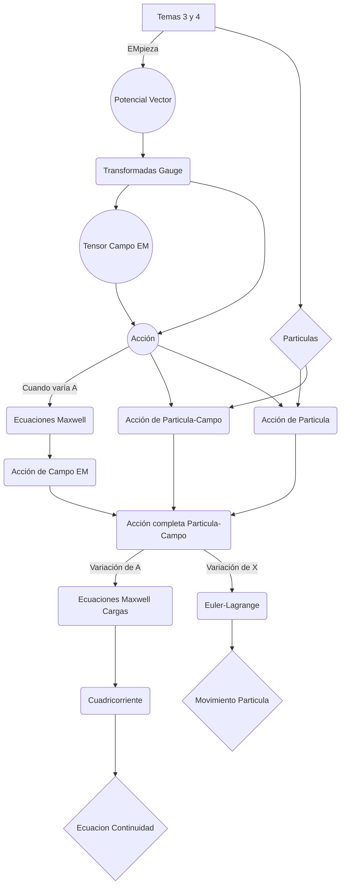

---------------
# T3:
____________
# {ACCIÓN DEL CAMPO ELECTROMAGNÉTICO}

## {ONDAS ELECTROMAGNÉTICAS}

En principio las ondas electromagnéticas están en todo el espaciotiempo.
Queremos describirlas con el valor que toman en cada punto:

$$
x^{\mu} \rightarrow \mathbf{E}(t,\mathbf{x}),\mathbf{B}(t,\mathbf{x}),
$$

También queremos que la formulación sea relativista desde el principio.
Para elo usaremos cuadrivectores.

La acción, al ser un escalar, tendrá un papel privilegiado en el desarrollo de la teoría

Diremos que el campo estará caracterizado por un cuadrivector:

$$
\mathbf{A}^{\mu}(t,\mathbf{x}),
$$

definido en cada punto del espaciotiempo.

$$
x^{\mu} \rightarrow x'^{\mu} = \Lambda^{\mu}_{\,\,\nu} x^{\nu} + a^\mu,
\\
\text{Espacio de configuración de la partícula}
$$
$$
\mathbf{A}^{\mu}(\mathbf{x}) \rightarrow \mathbf{A}'^{\mu}(\mathbf{x}') = \Lambda^{\mu}_{\,\,\nu} \mathbf{A}^{\nu}(\mathbf{x})
\\
\text{Espacio de configuración del campo EM}
$$

En [Amu] hay demasiada información. En la dirección longitudinal no hay propagación de la onda.

Imponemos la condición de invarianza gauge:

$$
\mathbf{A}^{\mu}(\mathbf{x}) \leftrightarrow  \mathbf{A}^{\nu}(\mathbf{x})-\partial_\mu f(\mathbf{x})
$$

La suma de una derivada total de una función aleatoria describe el mismo estado del campo electromagnético.

No es posible distinguir experimentalmente entre ambos casos.

Si hacemos un desarrollo de fourier en el término de la derivada total nos da una contribución [[proporcional a P, un modo longitudinal que no contribuye.

____________
### {ACCIÓN DEL CAMPO}

	Vamos a contruir la acción. Nos dará la dinámica del sistema.
	Estamos tratando el campo electromagnético como un sistema físico.

	Vamos a empezar usando [tau] en [Amu].
	Queremos que la formulación sea relativista.

	Usar la derivada en tau es la única elección con que podemos empezar.
	Será difícil trabajar con esa derivada, ya que en relatividad derivar respecto a tiempos implica que aparecerán derivadas respecto al espacio.

	Por ello usaremos directamente la cuadriderivada:

	[TENSOR LORENTZ]

	[DERIVADAS Y DESARROLLO]

$$
F_{\mu \nu} = \partial _{\mu} A_{\nu} -\partial _{\nu} A_{\mu}
$$

$$
F_{\mu \nu} (A) = F_{\mu \nu} (A')
$$

$$
F_{\mu \nu} = - F_{\nu \mu}
$$

Tensor del campo electromagnético o tensor fuerza.

La acción será:

[ACCION]

[Nota de notación]

[Landau y su notación]

[Unidades de la acción]

____________
## {ECUACIONES DE LA DINÁMICA DEL CAMPO ELECTROMAGNÉTICO}

Son aquellas que se deducen de $\delta S_{EM} = 0$ cuando $A_{\mu} \rightarrow A_{\mu} + \delta A_{\mu}$

Demostración:

[   ]

[   ]

Con ello deducimos las Ecuaciones del campo electromagnético para la dinámica.

$$
\partial_{\mu} F ^{\mu \nu} = 0
$$

Sustituyendo la definición de $F_{\mu\nu}$ se puede ver que __la ec de arriba__ se trata de dos las ecuaciones de Maxwell sin cargas.

____________
### {Campos eléctrico y magnético}

A partir de la definición de  $F ^{\mu \nu}$ en función de$A^{\mu}$ y desarrollando obtenemos una expresión para $\mathbf{E}$ y $\mathbf{H}$:

$$
\mathbf{E} = F^{0i}
,
\mathbf{H} = - \frac{1}{2} \epsilon^{ijk}F^{jk}
$$

____________
### {Cuadripotenciales}

Todo esto se deduce de el uso de $A^{\mu}$, pero aún no lo hemos definido.

Diremos que es una magnitud con unidades de [potencial EM] y lo llamaremos \textbf{cuadripotencial}.

Se expresa en función del potencial escalar $\phi$ y el potencial vector $\mathbf{A}$:

$$
A^{\mu}(x) =
\begin{pmatrix}
\phi (x) \\ A^i(x)
\end{pmatrix}
$$

Con estas definiciones finalmente sacamos:
$$
\nabla \cdot \mathbf{E} = 0, \quad \nabla \times \mathbf{H} = \frac {1}{c}\frac {\partial\mathbf{E}}{\partial t}
$$
$$\Updownarrow$$
$$
\partial_{\mu} F ^{\mu \nu} = 0
$$

____________
#### {Las otras dos ecuaciones de Maxwell}

Toman la forma:
$$
\epsilon^{\mu\nu\rho\sigma}\partial_{\mu} F _{\nu \rho} = \partial_{\mu} F _{\mu \rho} +\partial_{\nu} F _{\rho \mu} +\partial_{\rho} F _{\mu \nu} = 0
$$
$$\Updownarrow$$
$$
\nabla \cdot \mathbf{H} = 0, \quad \nabla \times \mathbf{E} = - \frac {1}{c}\frac {\partial\mathbf{H}}{\partial t}
$$

Primer par de ecuaciones de Maxwell

De lo que se deduce la dependencia de E y H en phi y A.

[Notacion Pro]

[Formas diferenciales]

[Th Gauss y Stokes]

____________
# {ECUACIONES CON CARGAS}

Las partículas interaccionan con el campo electromagnético.

[accion part-EM]

Accion incorrecta -> accion correcta

Para quitar la constante usaremos la derivada de xmu

[  ]

Para varias particulas sumo
Para una densidad de carga integro

[Accion completa]

[Analogia con la fuerza de Lorentz]

____________
### {Ecuaciones de movimiento}

____________
#### {Procedimiento}

\begin{itemize}
    \item delta S
    \item Condiciones xmu
    \item Segunda de Newton relativista
\end{itemize}

____________
#### {Maxwell}

	Empezamos con la condición de acción estacionaria.

	Queremos que la integral temporal sea en el espaciotiempo.
	Para ello usaremos la delta.

\textbf{Cuadricorriente}

	Así las ecuaciones de Maxwell quedan:

[Eqs con cargas]

____________
### {Cuadricorriente}

[Ecuaciones]

$$
\partial_{\mu} F ^{\mu \nu} = -\frac{4\pi}{c}\rho ^\nu
$$

$$
\nabla \cdot \mathbf{j} = -\frac{\partial\rho}{\partial t}
$$
[Unidades]

----

# T3 Mermaid flujo

----

------
# T5:
------

# Conservacion de E y p por el teorema de Noether

----
# T8:

---

# T8: The field of moving charges

Que Os PARECE

### Solución general de la homogénea + Solución particular

$\phi (X, t) = \phi_{particular} + \phi_{0p}$

Para la solución de la no homogénea descompone los la densidad de carga en elementos puntuales y calculamos el campo que genera cada uno.

> Aqui la notación de landau no es satisfactoria. Usaremos

Habrá que integrar para todas las contribuciones:
1. $X \neq X'$
2. Queremos simetria radial en la parte homogénea. $R = |X - X'|$
3.
